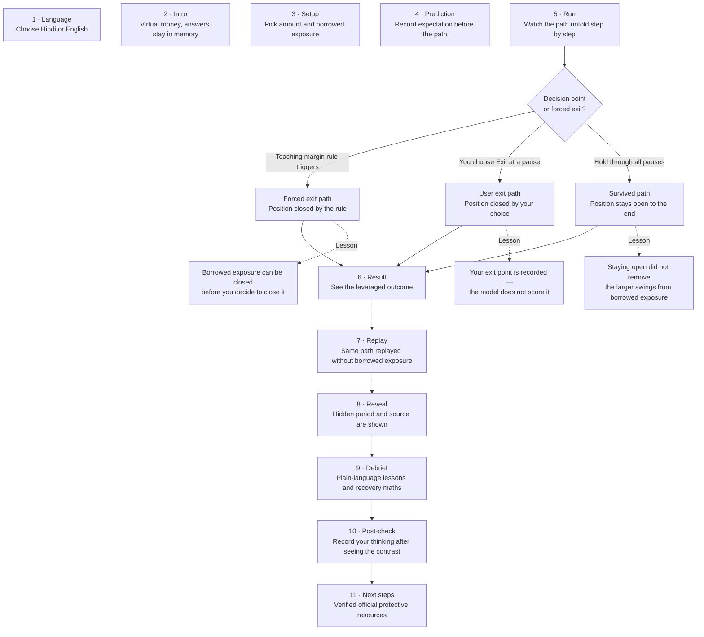

# Anubhav — interactive investor education with virtual money

Free, plain-language, choose-your-path financial education in **Hindi and English**,
for people with no finance background. Users make choices with virtual money on real
past market history and see where each choice leads — before they face it for real.

This is a first step in understanding risk before investing. It does not tell you what
to buy or sell. Jargon is explained in plain words when it appears: term cards with
analogies, short sentences, captions, and audio narration.

There is no scoreboard. There is no reward for making money in the practice.

---

## Who it is for

Anyone who has seen a forwarded message promising quick gains from borrowed exposure
and wants to understand what that actually means before risking real money —
in particular, first-time or retail learners in India with no finance background.

---

## The 11-step journey

Every session goes through these steps in order. Steps 1–3 set up the context.
Step 5 (Run) is where the path branches depending on what happens and what you choose.
All paths rejoin at Step 6 and continue to the end.



*Each path leads to a different lesson in the debrief; all paths then replay the
same unleveraged comparison, reveal the hidden period, and end at the same resources.*

---

## How the app explains jargon

Jargon is never assumed — it is explained in plain words when it appears:

- **Term cards** appear at the debrief step. Tap a term (leverage, margin, forced exit,
  volatility, drawdown, recovery maths, diversification, compounding, fees) for a
  one-sentence plain explanation and a real-world analogy.
- **Short sentences** throughout the journey — no paragraph walls.
- **Captions** are complete text equivalents of every narration clip.
- **Audio narration** (Hindi and English) plays on request at each step, or
  automatically if you opt in to auto-speak. Auto-speak is off by default.

---

## What it is not

- **Not investment advice.** No buy/sell/hold recommendation is given at any point.
- **Not a trading app.** No real money, no real accounts, no real instruments.
- **Not a forecast.** One episode from the past does not predict the future.
- **Not endorsed by any regulator or exchange.** Protective resource links point to
  official bodies (SEBI, RBI) as factual pointers only. No endorsement is implied.
- **Not a game with rewards.** There are no points, levels, badges, streaks,
  leaderboards, or rewards for any outcome.

---

## Features

| Feature | Status |
|---|---|
| Hindi + English, bilingual throughout | ✓ |
| 11-step choose-your-path journey | ✓ |
| Virtual-money simulation with borrowed exposure (2×, 5×, 10×) | ✓ |
| Decision points: hold or exit during the run | ✓ |
| Same-path unleveraged comparison | ✓ |
| Hidden period revealed only at step 8 | ✓ |
| Plain-language debrief with recovery maths | ✓ |
| Term cards with analogies (9 terms) | ✓ |
| Audio narration (Hindi and English, 58 clips) | ✓ |
| Auto-speak (opt-in, off by default) | ✓ |
| Captions for every narration clip | ✓ |
| In-app learning chat (backed by a 212-entry knowledge base + Groq) | ✓ |
| Verified official protective resource links | ✓ (4 links checked) |
| Two real historical data windows (ECB reference observations) | ✓ |
| Offline-capable (PWA, previously cached content only) | ✓ |
| Large accessible controls, two-pane + mobile layout | ✓ |
| No accounts, no analytics, no tracking | ✓ |

---

## Privacy

**Core journey:** prediction, virtual amounts, choices, and reflection answers stay
in React reducer memory only. They are discarded on reload or restart. Nothing from
the practice is sent anywhere.

**Chat:** when you submit a question through the Chat panel, your question and
selected language are sent via same-origin HTTPS to a server function, which calls
**Groq** (model: `openai/gpt-oss-120b`) to answer general learning questions from the
knowledge base. No journey answers, amounts, or step state are ever included.
Groq's usage-metadata retention policy applies; see **About this app** in the
running app for the full disclosure.

**Storage:** only language and auto-speak preferences persist (localStorage).
No cookies, no analytics, no financial or personal data storage.

See [`docs/PRIVACY.md`](docs/PRIVACY.md) for full details.

---

## Limits

- **Language:** Hindi and English strings were checked by an automated agent
  (back-translation QA). They have had a human listening review but have not had
  a native-speaker pronunciation or cultural-clarity review.
- **Simulation model:** a simplified teaching model. Real slippage, spread, fees,
  financing, taxes, liquidity, and execution details are omitted.
- **Data:** two real historical windows use ECB daily reference observations —
  not equity prices, not Indian market data, not executable quotes. They are
  retrospectively selected, not a representative or random sample.
- **One episode:** one recorded path is a teaching example. It does not predict
  any future outcome.
- **Chat:** the learning chat can be wrong. It refuses investment-advice questions
  locally and on the server, but it is not a regulated financial service.
- **Offline audio:** only previously cached clips play offline. Not every clip is
  pre-installed.

See [`docs/LIMITATIONS.md`](docs/LIMITATIONS.md) for the full list.

---

## Tech

- **Frontend:** Vite + React 19 + TypeScript (strict) + Tailwind CSS v4
- **PWA:** vite-plugin-pwa / Workbox
- **Server (chat):** Netlify Functions (portable Vite middleware in dev)
- **AI provider:** GroqCloud — `openai/gpt-oss-120b` (server-side only)
- **Data:** two ECB-derived episode JSONs; pure deterministic engine (no I/O)
- **Audio:** Indic Parler TTS (build-time only, offline), Whisper ASR gates,
  compact Opus assets
- **Tests:** Vitest (unit), Playwright (browser/layout), axe-core (accessibility rules)

---

## Third-party components

| Component | Version | Licence |
|---|---|---|
| React / React DOM | 19.3.0 | MIT |
| Vite + React plugin | 8.3.2 / 6.1.1 | MIT |
| vite-plugin-pwa | 1.3.0 | MIT |
| Tailwind CSS | 4.3.3 | MIT |
| TypeScript | 6.0.3 | Apache-2.0 |
| Vitest | 5.0.3 | MIT |
| Playwright | 1.63.0 | Apache-2.0 |
| axe-core/playwright | 4.13.0 | MPL-2.0 |
| GroqCloud (runtime) | service | proprietary terms |
| Indic Parler TTS (build) | ai4bharat/indic-parler-tts | Apache-2.0 (weight licence: TODO — upstream training attribution unresolved) |
| Whisper ASR (build) | openai/whisper-small | Apache-2.0 |
| ECB reference data | — | ECB reuse terms (attribution + modification notice) |

Full inventory, licence evidence, and unresolved upstream questions:
[`docs/THIRD_PARTY.md`](docs/THIRD_PARTY.md) and
[`public/THIRD_PARTY_NOTICES.txt`](public/THIRD_PARTY_NOTICES.txt).

---

## Run locally

Requires Node.js and npm (see [`docs/DEPLOYMENT.md`](docs/DEPLOYMENT.md) for exact versions).

```sh
npm ci
npm run dev
```

For the learning chat, add a server-side Groq key to a gitignored `.env.local`:

```sh
GROQ_API_KEY=your_key_here
```

**Production checks** (run before any commit):

```sh
npm run lint
npm run typecheck
npm run test
npm run check:content
npm run build
npm run check:bundle
npm run release
```

**Layout screenshots** (local only, gitignored):

```sh
npm run test:layout
npm run screenshots:contact
```

---

## Project layout

```
src/
  config/       App name, episode list, simulation config, language list
  engine/       Pure deterministic simulation, debrief selector, stats
  journey/      React reducer, steps list, simulation hook
  screens/      One component per step (LanguageSelect → … → NextSteps)
  components/   Shared UI: charts, gauges, glossary card, audio controls
  content/      en/ and hi/ JSON strings, review-status registry
  audio/        Audio manager and manifest loader
  chat/         Chat panel, KB lookup, local refusals
  i18n/         String resolver, number/currency formatters
data/           Validated episode JSONs (ECB-derived)
server/         Chat API handler (Netlify Function / Vite middleware)
shared/         Chat config flag (CHAT_ENABLED)
scripts/        Content checker, bundle checker, release gate, audio pipeline
docs/           Architecture, privacy, limitations, data sources, third-party notices
public/         Static assets, audio manifest, service worker, notices
```

---

## Guardrails

- No buy/sell/hold recommendations, price targets, real instrument names, brokers,
  or promotions — in UI, audio, or chat responses.
- No accounts, cookies, analytics, personal/financial storage, or external runtime
  APIs (except the single disclosed Groq chat call).
- Chat advice/tip/prediction requests are refused locally before any network call,
  and refused again on the server.
- Release gate blocks draft copy, unverified resources, stale audio, and unsafe
  content. `agent-checked` content passes with a loud warning listing every string;
  only human-`reviewed` content passes silently. Agents never assign `reviewed`.

See [`docs/GUARDRAILS.md`](docs/GUARDRAILS.md).

---

## Disclaimer

This app uses virtual money and simplified teaching rules only. It is not financial
advice, a trading platform, a brokerage, or an investment product. It is not
endorsed by SEBI, RBI, any exchange, or any regulator. One recorded episode does not
predict future market behaviour. No claim of learning efficacy is made.
