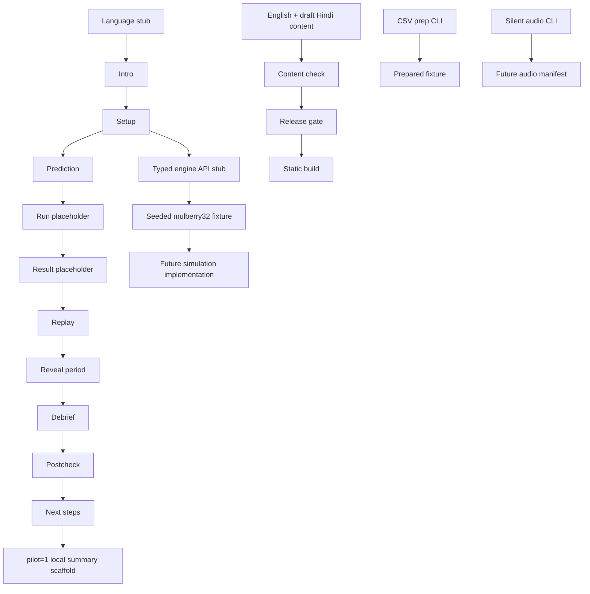

# Architecture

## Phase 0 shape

The fixed implementation target is a Vite React application in strict TypeScript, styled with Tailwind, tested with Vitest, linted with ESLint, formatted with Prettier, and packaged with `vite-plugin-pwa`. Python 3.10+ scripts handle offline preparation tasks. The repository has configuration, bilingual content, and a preparation-script scaffold, but no interactive screen or engine implementation; this remains an intended contract rather than a complete module graph.

The product name has one source of truth: `src/config/app.ts`. Components may import that value; docs and participant-facing copy say **the app** rather than duplicating it.

## Boundaries

- **Presentation:** route-like stub states, language/text-size controls, explicit placeholder labels, keyboard and screen-reader semantics.
- **Content:** versioned English strings followed by draft Hindi, glossary terms, content validation, and release blockers.
- **Engine boundary:** typed API stubs for seed, path, exposure, equity, warnings, forced exit, recovery, and summary statistics. Phase 0 may return fixtures; it must not claim to run a simulation.
- **Synthetic data:** seeded `mulberry32` values and a geometric path fixture. It is deterministic test input, never a source of real data.
- **Preparation tools:** Python CSV preparation and silent audio CLI contracts. They do not fetch data, generate sound, or invent calendar facts.
- **Build/release:** content, type, test, bundle-budget, and release checks. Release intentionally blocks unresolved placeholders and unverified resources.

## Mermaid flow

## Data flow and storage

A participant selection is held in memory during the flow. Only language and text-size preference may be persisted locally. No financial value, prediction, response, or pilot answer is persisted by the product in Phase 0. Static assets are same-origin; no runtime API or telemetry endpoint is allowed.

## API stub contract

Future typed boundaries should expose pure, serializable operations such as `makeSeededPath(seed, config)`, `computeExposure(capital, leverage)`, `computeEquity(capital, units, price, entry)`, `evaluateIntrabarLow(...)`, and `summarizePath(...)`. Each must document units, rounding, invalid inputs, and whether it is a fixture or implemented engine. No component may silently substitute a real data fetch.
