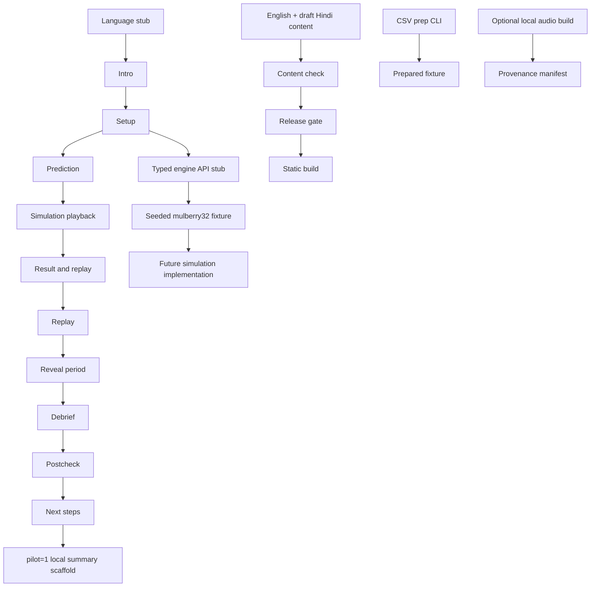

# Architecture

## Phase 3 shape

The fixed implementation target is a Vite React application in strict TypeScript, styled with Tailwind, tested with Vitest, linted with ESLint, formatted with Prettier, and packaged with `vite-plugin-pwa`. Python 3.10+ scripts handle offline preparation tasks. Phase 3 includes the bilingual journey, deterministic simulation playback, display/spoken content contracts, fail-closed content checks, and an optional local-only Indic Parler audio build with hashes, Opus conversion, and manifest provenance. Reviewed audio playback, PWA registration, offline behavior, and verified real episodes remain unimplemented.

The product name has one source of truth: `src/config/app.ts`. Components may import that value; docs and participant-facing copy say **the app** rather than duplicating it.

## Boundaries

- **Presentation:** route-like journey states, language/text-size controls, explicit synthetic/unavailable labels, keyboard and screen-reader semantics.
- **Content:** versioned English strings followed by draft Hindi, glossary terms, content validation, and release blockers.
- **Engine boundary:** pure TypeScript functions for seed, path, exposure, equity, warnings, forced exit, recovery, summary statistics, and same-path replay. The engine accepts no I/O or DOM dependencies; synthetic fixtures are not market data.
- **Synthetic data:** seeded `mulberry32` values and a geometric path fixture. It is deterministic test input, never a source of real data.
- **Preparation tools:** Python CSV preparation and optional local-only audio generation. The audio path never downloads a model, makes runtime requests, or invents spoken content.
- **Build/release:** content, type, test, bundle-budget, and release checks. Release intentionally blocks unresolved placeholders and unverified resources.

## Mermaid flow

## Data flow and storage

A participant selection is held in memory during the flow. Only language and text-size preference may be persisted locally. No financial value, prediction, response, or pilot answer is persisted by the product. Episode preparation and optional audio generation run offline and write explicit artifacts; Phase 3 playback consumes checked-in static fixtures only, and the UI keeps audio unavailable until assets are reviewed. Candidate real episodes remain outside the runtime import until reviewed. Static assets are same-origin; no runtime API or telemetry endpoint is allowed.

## API stub contract

Future typed boundaries should expose pure, serializable operations such as `makeSeededPath(seed, config)`, `computeExposure(capital, leverage)`, `computeEquity(capital, units, price, entry)`, `evaluateIntrabarLow(...)`, and `summarizePath(...)`. Each must document units, rounding, invalid inputs, and whether it is a fixture or implemented engine. No component may silently substitute a real data fetch.
