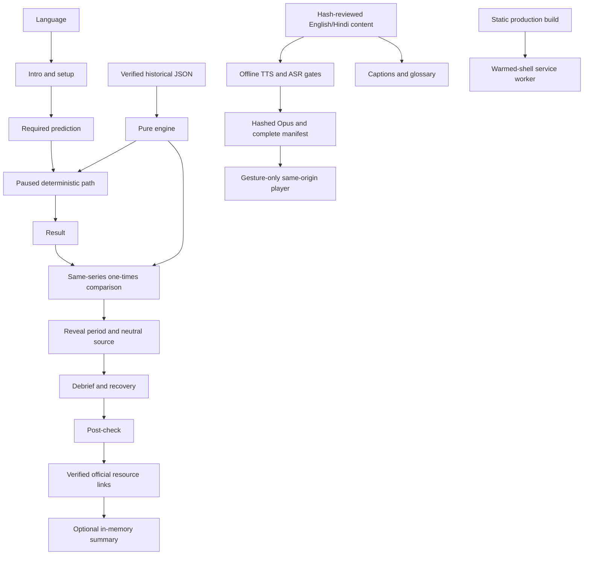

# Architecture

## Implemented shape

Vite + React reducer state + strict TypeScript, plain JSON bilingual content,
Tailwind/CSS, Vitest and browser tests, and vite-plugin-pwa/Workbox. Python
prepares verified historical windows and quality-gated static speech **at build
time**. The pure engine performs no I/O. Product name: `src/config/app.ts` only.

## Boundaries

- **Presentation:** App/screens/components render the journey, chart tables,
  controls, captions and glossary; use content files for all learner strings.
  Heading focus, native controls, reading-size preference and reduced motion
  are separate from numerical logic.
- **Journey:** reducer requires prediction, real simulation result and
  post-check before advancing. `useSimulationRun` schedules/pauses playback;
  all answers and the local pilot summary remain in memory.
- **Engine:** `runSimulation`, `positionUnits`, `equityAt`,
  `recoveryGainFraction`, `calculateStats`, `replayUnleveraged`, `compareRuns`
  and `selectDebrief` are pure, deterministic, serializable teaching operations.
  Synthetic mulberry32 fixtures remain for tests, never fabricated history.
- **Data:** production episode registry imports two schema-validated ECB
  windows. Exact source/reuse/validation evidence lives in provenance/docs;
  only neutral labels/details render, with dates/source institution at reveal.
- **Content:** English/Hindi display/spoken separation. Hash-bound leaf review
  registry, QA/back-translations, status draft → agent-checked → reviewed.
  Only human evidence can establish reviewed. Every agent-checked leaf warns.
- **Audio:** one gesture-started `AudioManager`; schema-2 completeness, same-
  origin path, current text hash and actual asset bytes/hash must match.
  Provider/ASR models are local build-only, not browser dependencies. Failure
  preserves text. Spoken asset manifest is not a participant record.
- **Offline:** production service worker precaches public shell assets and
  caches requested audio with expiry/version cleanup. No bulk audio precache,
  personal-data caching or cold-start-offline promise.
- **Release:** lint/types/unit/content/audio/build/bundle/release gates, plus
  production-browser/offline/network tests and measured local Lighthouse.
  Public notices and host CSP instructions accompany the static output.

## Storage/network contract

Only language/text-size preferences persist as app localStorage. Public static
assets and audio use Cache Storage/Workbox expiry metadata. Predictions,
amounts, choices and pilot answers are not serialized to persistent browser
storage, URLs or a server. Explicit optional clipboard copy is user-controlled
outside the app's storage; see PRIVACY.md. No remote model, live data source,
analytics, cookie, font or service runs in the participant app. Official links
are deliberate external navigations with disclosure, not background requests.

Explicit build-time acquisition is separate from the offline preparation and
inference paths. Caches, raw source downloads and rejected/audition WAVs are
ignored; only reviewed-by-policy JSON/content and passed compact audio become
static assets. Technical gating does not certify legal rights, native fluency,
listening quality, human accessibility or pilot consent.
